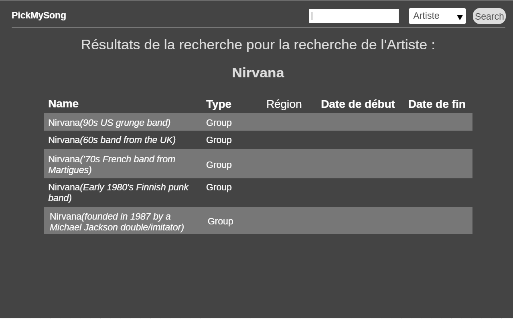
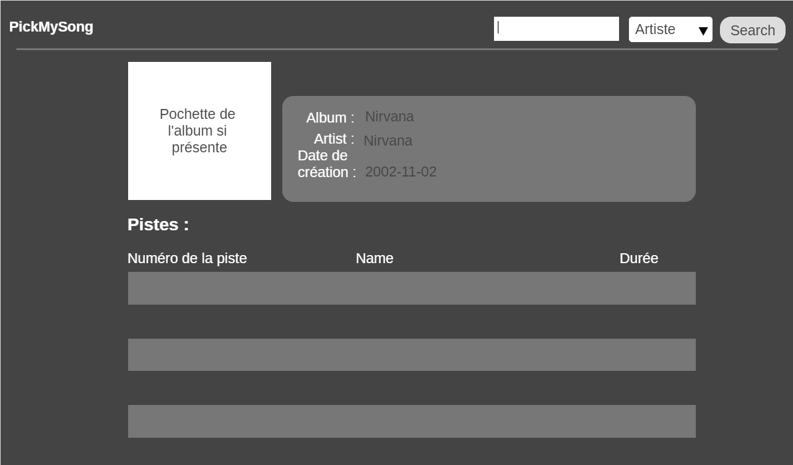

# Projet PickMySong

Dans ce projet, nous devions développer un site nous permettant de rechercher des artistes ou des réalisations musicales à l'aide des technologies suivantes :

- Vue.js : Afin d'élaborer le backend
- Axios.js : Qui simplifiera les requêtes ajax
- Bootstrap : Pour permettre de créer un affichage

En ce qui concerne la récupération des informations, nous devions donc utiliser le site https://musicbrainz.org. Cependant, cette API ne comportant pas les images des réalisations musicales, nous avons utilisé https://coverartarchives.org pour récupérer les images pochettes.

##Visuels du site web

##Travail réalisé

##Structure du code

###Lisibilité
Pour pouvoir être lisible et compréhensible, chaque fonction est commenté. De même, le type de chaque variable est précisé et l'usage de ces dernières est précisé.

###Maintenabilité du code
